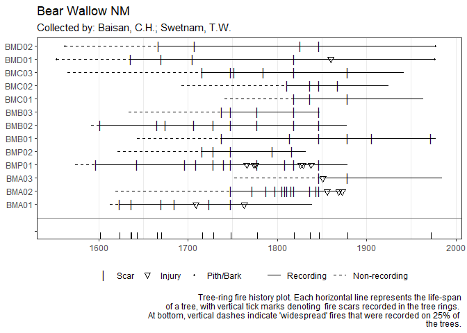

<!-- README.md is generated from README.Rmd. Please edit that file -->

# rIMPD

<!-- badges: start -->

[](https://github.com/chguiterman/rIMPD/actions)
<!-- badges: end -->

The goal of rIMPD is to enable fast and easy exploration of
publicly-available tree-ring fire history data in R.

Using `rIMPD`, you can discover the fire history sites across the North
American continent:

``` r
library(rIMPD)
library(ggplot2)
library(dplyr)
library(sf)

all_sites <- search_impd() %>% 
    st_as_sf(coords = c("longitude", "latitude"), crs=4326) 

ggplot() +
  geom_sf(data = spData::world) +
  geom_sf(data = all_sites, color = "purple") +
  coord_sf(xlim=c(-165, -50), ylim=c(15, 70)) +
  labs(title = "North American Tree-Ring Records on the IMPD",
       caption = paste0("Data current as of ", lubridate::today())
       ) +
  theme_void()
```


The tree-ring data associated with each site can be obtained directly:

``` r
site_to_get <- all_sites[10, ]$studyCode
fhx <- get_impd_fhx(site_to_get)
```

and analyzed with tools from the `burnr` library, for example:

``` r
library(burnr)
plot_demograph(fhx, 
               composite_rug = TRUE,
               plot_legend = TRUE) +
  labs(title = all_sites[10, ]$siteName, 
       subtitle = paste0("Collected by: ", all_sites[10, ]$investigators),
       caption = "Tree-ring fire history plot. Each horizontal line represents the life-span
       of a tree, with vertical tick marks denoting  fire scars recorded in the tree rings. 
       At bottom, vertical dashes indicate 'widespread' fires that were recorded on 25% of 
       the trees.")
```



Funding for `rIMPD` was provided by the USGS Community for Data
Integration <https://www.usgs.gov/centers/cdi>
